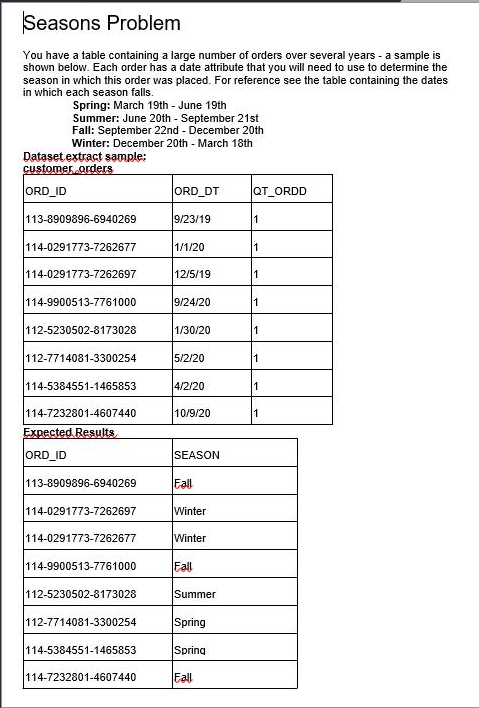

#Seasons Project

# How to install 

create virtual environment
`python3 -m venv nameVenv`

activate virtual environment windows
`nameVenv\Scripts\activate`

activate virtual environment linux
`source nameVenv/bin/activate`

install requirements
`pip install -r requirements.txt`

make migrations with 
`python3 manage.py makemigrations seasons`

and
`python3 manage.py migrate`

# Start

start server on localhost
`python3 manage.py runserver`


now you can POST new data at the endpoint `http://localhost:8000/date`

whit the format 
```
{
    "ord_dt": "2008-10-28",
    "qt_ordd": 2
}
```
and you can get the data with seasons at the endpoint `http://localhost:8000/seasons`

#Example


###Output
```
[
    {
        "pk": 1,
        "season": "spring"
    },
    {
        "pk": 2,
        "season": "winter"
    },
    {
        "pk": 3,
        "season": "winter"
    },
    {
        "pk": 4,
        "season": "autumn"
    },
    {
        "pk": 5,
        "season": "autumn"
    }
]
```

